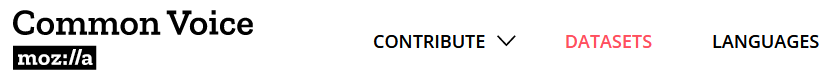
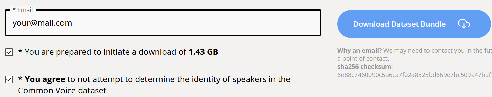
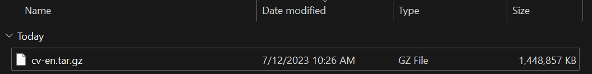
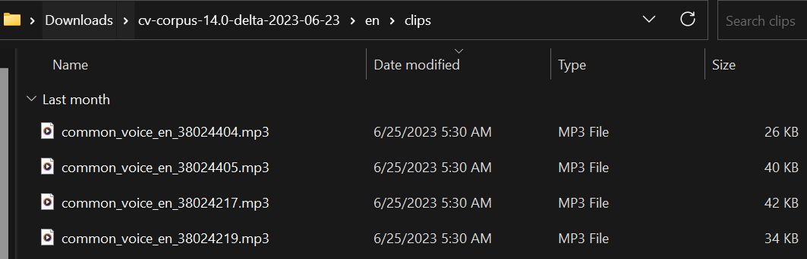

# summer_project
exploratory AI project with course colleagues during summer break

## Data Collection

For simplicity's sake, we use <a href="https://commonvoice.mozilla.org">Mozilla Common Voice</a> to gather our audio files. These files are used to train the model to recognize the voices that should not be used.

The target voice could be from <a href="https://files.catbox.moe/mhmw0h.mp3">a 5-minute Trump clip</a>.

In the Mozilla Common Voice link, navigate to "Datasets". 

Select a file, agree to the terms, enter your email, and proceed with the download. 

After the file is downloaded, rename it to something more manageable. 

Open the folder in the terminal and extract the file. 

You should now have a folder containing text files and MP3 files. 

